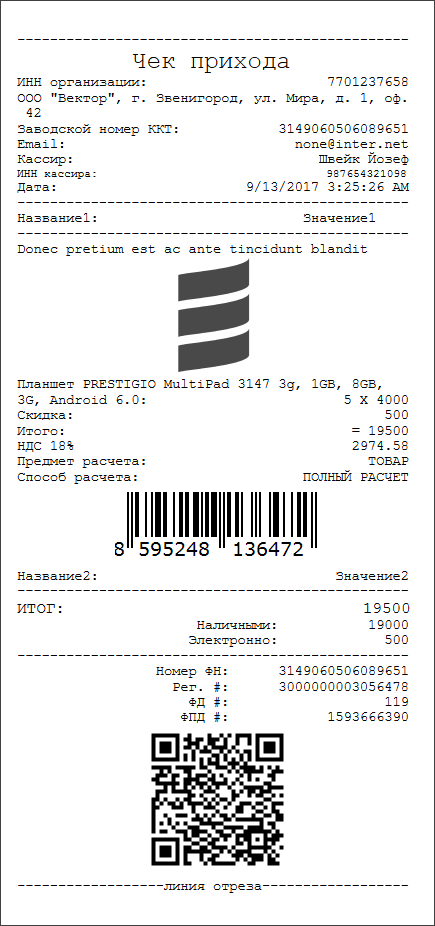

# kkmserver-api

Scala API для сервера печати чеков/этикеток [KkmServer](https://kkmserver.ru/KkmServer).

Для установки выполните команды

    git clone https://github.com/alexanderfefelov/kkmserver-api.git
    
[Разверните](extra/kkmserver/vagrant/README.md) тестовую операционную систему и запустите тесты 

    cd kkmserver-api
    sbt test

Если тесты завершились успешно, опубликуйте API

    cd kkmserver-api
    sbt publishLocal

и добавьте в файл `build.sbt` вашего проекта строку

    libraryDependencies += "alexanderfefelov.github.com" %% "kkmserver-api" % "0.1.1-SNAPSHOT"

